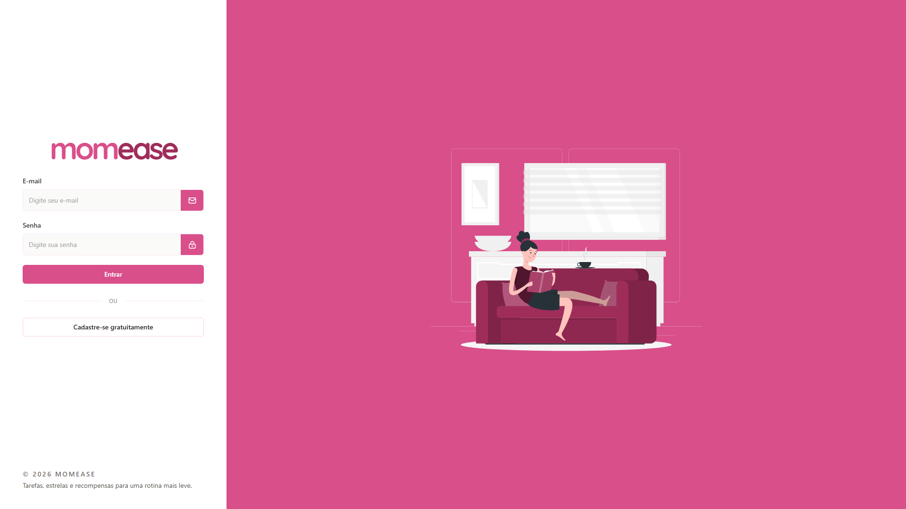
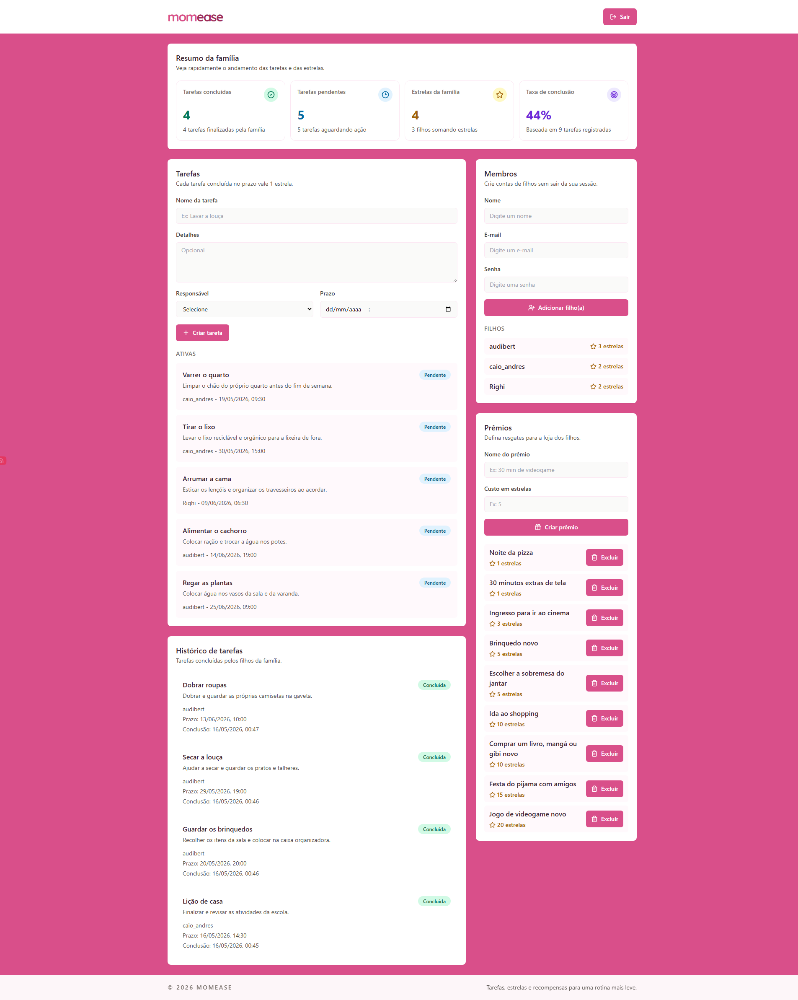

# MomEase

> Projeto desenvolvido para o **Hackathon de Dia das Mães do Servidor dos Programadores**.
> **A melhor comunidade dev do Brasil**: [clique aqui para fazer parte](https://discord.gg/programador).

**MomEase** ajuda mães a organizar a rotina da casa com mais clareza, menos cobrança e mais participação dos filhos.

O problema que o MomEase ataca é concreto e mensurável. Segundo o [IBGE](https://agenciadenoticias.ibge.gov.br/agencia-noticias/2012-agencia-de-noticias/noticias/37621-em-2022-mulheres-dedicaram-9-6-horas-por-semana-a-mais-do-que-os-homens-aos-afazeres-domesticos-ou-ao-cuidado-de-pessoas), em 2022 as mulheres dedicaram, em média, **21,3 horas por semana** a afazeres domésticos e/ou cuidado de pessoas, contra **11,7 horas** dos homens. A diferença foi de **9,6 horas semanais**.

Mas a sobrecarga não está apenas em executar tarefas. O [Modern Family Index 2017, da Bright Horizons](https://investors.brighthorizons.com/news-releases/news-release-details/new-research-shows-mental-load-real-and-significantly-impacts), mostrou que **86% das mães que trabalham** afirmam lidar com todas as responsabilidades da família e da casa, **72%** dizem que acompanhar a agenda dos filhos é sua responsabilidade e **69%** relatam uma carga mental significativa. Como explica [Allison Daminger em _The Cognitive Dimension of Household Labor_](https://doi.org/10.1177/0003122419859007), essa carga também envolve **antecipar necessidades, identificar opções, tomar decisões e monitorar o andamento da rotina**.

O MomEase transforma esse cenário em uma rotina mais clara, leve e compartilhada, conectando **mãe e filhos** em um fluxo de tarefas, estrelas e recompensas.

## Por que este projeto importa

Organizar a casa não é apenas dividir tarefas. Também envolve:

- lembrar o que precisa ser feito
- decidir quem vai fazer
- cobrar no momento certo
- acompanhar se foi concluído
- manter os filhos engajados

Esse trabalho invisível costuma recair sobre a mãe.

O MomEase foi pensado para aliviar exatamente esse ponto: em vez de depender só de cobrança verbal e memória, a família passa a usar uma experiência simples, visual e motivadora.

## Proposta para o hackathon de Dia das Mães

No Dia das Mães, falar de cuidado também é falar de **tempo, energia e sobrecarga emocional**.

O MomEase é relevante para esse tema porque:

- valoriza o trabalho invisível de organização feito pelas mães
- incentiva a participação ativa dos filhos na rotina doméstica
- transforma cobrança em colaboração
- cria uma dinâmica mais positiva dentro de casa

O projeto propõe uma forma de **apoiar mães com tecnologia útil no dia a dia**.

## Como funciona

1. A mãe cria sua conta e automaticamente inicia uma família.
2. No dashboard, ela cadastra os filhos, cria tarefas e define recompensas.
3. Cada filho entra no próprio painel, visualiza suas tarefas e conclui atividades.
4. Tarefas entregues no prazo geram estrelas.
5. As estrelas podem ser trocadas por prêmios definidos pela própria família.

## O que o MomEase resolve

- Centraliza a organização da rotina da casa em um painel simples.
- Dá visibilidade ao que está pendente e ao que já foi concluído.
- Ajuda mães a delegarem com mais clareza.
- Estimula autonomia e responsabilidade nos filhos.
- Recompensa colaboração de forma lúdica e fácil de entender.

## Diferenciais do projeto

- **Dois dashboards distintos**: um para a mãe gerenciar a rotina e outro para o filho executar tarefas.
- **Gamificação simples e funcional**: tarefas concluídas geram estrelas e as estrelas viram recompensas.
- **Resumo familiar no topo do dashboard**: visão rápida de tarefas concluídas, pendentes, estrelas acumuladas e taxa de conclusão.
- **Criação de contas de filhos sem deslogar a mãe**: a mãe mantém sua sessão ativa enquanto organiza toda a família.
- **Fluxo direto e acessível**: sem menus complexos, sem excesso de etapas, focado em uso rápido.

## Funcionalidades implementadas

- Cadastro exclusivo para mães com criação automática de `family_id`
- Login único para mães e filhos com redirecionamento por perfil
- Painel da mãe para:
  - adicionar filhos
  - criar tarefas
  - acompanhar tarefas ativas e histórico
  - criar e excluir prêmios
- Painel do filho para:
  - visualizar tarefas pendentes
  - concluir tarefas
  - acompanhar histórico
  - resgatar recompensas
- Sistema de estrelas para tarefas concluídas no prazo
- Regras de negócio com Server Actions

## Fluxo da aplicação

- `/register`: cadastro da mãe
- `/login`: login unificado
- `/mother`: dashboard da mãe
- `/child`: dashboard do filho

## Screenshots

### Login



### Dashboard



## Tecnologias

- **Next.js** com App Router
- **TypeScript**
- **Tailwind CSS**
- **Supabase Auth**
- **Supabase Database**
- **Server Actions**
- **Lucide React**

## Como rodar localmente

1. Instale as dependências:

```bash
npm install
```

2. Crie o arquivo `.env.local` com base no `.env.example`:

```bash
NEXT_PUBLIC_SUPABASE_URL=https://your-project.supabase.co
NEXT_PUBLIC_SUPABASE_PUBLISHABLE_KEY=your-publishable-or-anon-key
NEXT_PUBLIC_SUPABASE_ANON_KEY=your-anon-key
SUPABASE_SERVICE_ROLE_KEY=your-service-role-key
```

Use `NEXT_PUBLIC_SUPABASE_PUBLISHABLE_KEY` em projetos Supabase mais novos. A chave anon antiga continua aceita como fallback.

3. Rode o SQL em `supabase/schema.sql` no SQL Editor do Supabase.

4. Inicie o projeto:

```bash
npm run dev
```
